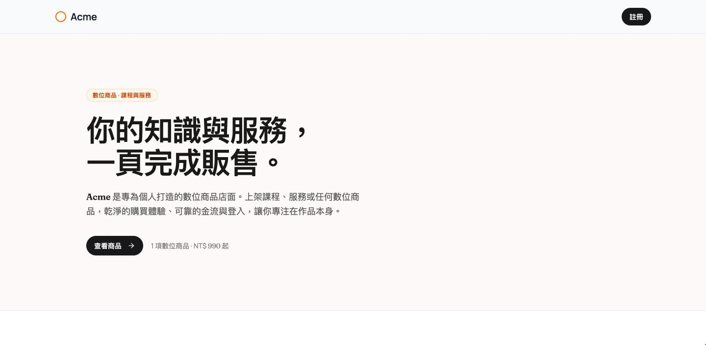
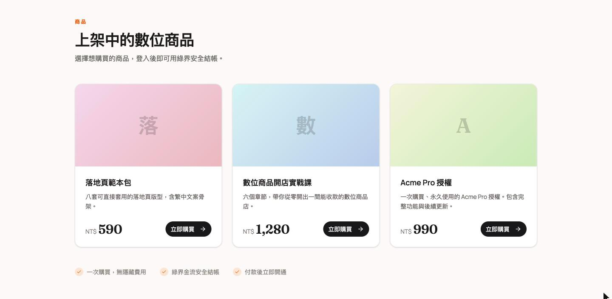
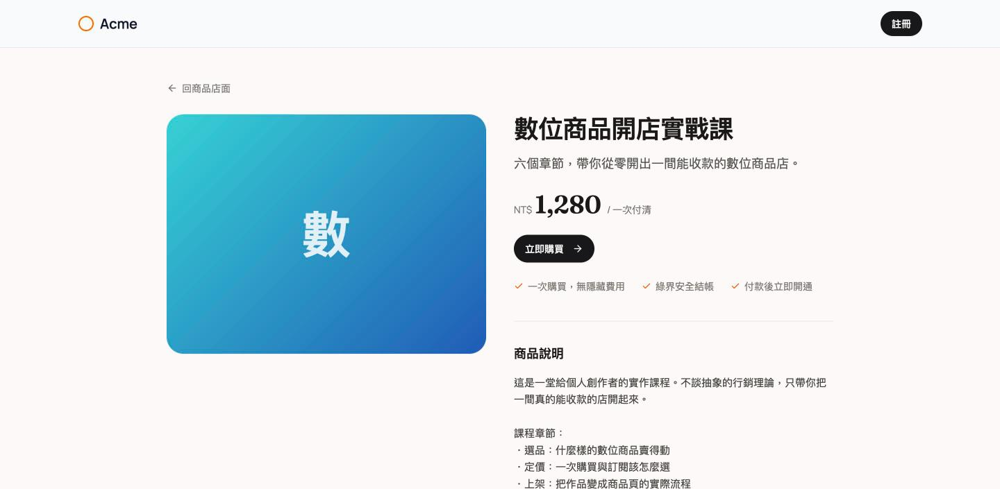

# SoloStore TW

給個人創作者的**數位商品店面**起手式：**Next.js（App Router）＋ Supabase ＋ Postgres/Drizzle**，串接台灣**綠界（ECPay）** 金流，一次購買、繁體中文、一頁式店面。
特色：Supabase 認證、使用者 id 用 uuid、綠界金流、商品／詳述頁、訂單記錄——乾淨的單人底。

> 展示品牌為 `Acme`（占位）。改 `config/site.ts` 或設 `NEXT_PUBLIC_SITE_NAME` 即可換成你的品牌。

## 畫面



跑完 `pnpm db:seed` 後的商品列表——無圖商品會依名稱自動生成漸層（`lib/products/gradient.ts`），不必先準備素材。



商品詳述頁，未登入也可瀏覽；按下購買才導向登入。



## 技術棧

- **框架**：[Next.js 16](https://nextjs.org/)（App Router、`proxy.ts`）
- **登入 / Session**：[Supabase Auth](https://supabase.com/) via [`@supabase/ssr`](https://supabase.com/docs/guides/auth/server-side/nextjs)
- **資料庫**：Postgres（Supabase）＋ [Drizzle ORM](https://orm.drizzle.team/)
- **UI**：Tailwind CSS ＋ shadcn/ui

## 認證架構

- 登入 / session 一律走 `@supabase/ssr`（server / browser client 於 `lib/supabase/`）。
- `proxy.ts`（Next 16 慣例，取代 middleware）負責刷新 session 並對 `/dashboard` 做樂觀導向。
- 權威驗證在 `lib/auth/dal.ts`（`getCurrentUser` / `requireUser`）——受保護頁面在頁面層再驗一次，不只靠 proxy。
- 使用者資料表為 `public.profiles`（uuid 主鍵 = `auth.users.id`），開啟 RLS，註冊時由 DB trigger 自動建立。

## 開始使用

```bash
pnpm install
cp .env.example .env   # 填入 Supabase 專案的 URL / anon key 與 Postgres connection string
```

### 套用資料庫 migration（連上真的 Supabase 後）

```bash
pnpm supabase link --project-ref <your-project-ref>
pnpm supabase db push
```

`supabase/migrations/20260709184941_init_schema.sql` 是唯一一支 migration，一次建立完整 schema：`profiles`（含 RLS 與註冊 trigger）、`products` / `orders` / `payments` 金流領域表與其 RLS，以及付款回呼用的 `record_payment_callback()` 函式。

### 灌入示範商品（選用）

```bash
pnpm db:seed
```

以商品 `name` 冪等——重跑會收斂到相同狀態，不會產生重複商品。要換成自己的商品，改 `lib/db/seed.ts` 後重跑，或直接改 DB。

### 開發

```bash
pnpm dev
```

開 [http://localhost:3000](http://localhost:3000)。

## 環境變數

完整清單見 [`.env.example`](./.env.example)。

### Supabase（必填）

| 變數 | 說明 |
| --- | --- |
| `NEXT_PUBLIC_SUPABASE_URL` | Supabase 專案 URL |
| `NEXT_PUBLIC_SUPABASE_ANON_KEY` | Supabase anon key（會內聯進前端，屬公開值） |
| `POSTGRES_URL` | Postgres connection string（Drizzle 用）。serverless 部署建議用 Supabase Transaction pooler（port 6543）＋ `prepare:false` |
| `SUPABASE_SECRET_KEY` | **伺服端專用機密**。金流回呼沒有使用者 session，需用它繞過 RLS 寫入付款結果——不設的話付款會失敗。用新版 `sb_secret_...`（舊版 service_role key 亦相容）。**絕不可進前端、絕不可加 `NEXT_PUBLIC_` 前綴。** |

### 金流（用綠界時必填）

| 變數 | 說明 |
| --- | --- |
| `PAYMENT_PROVIDER` | `ecpay`（預設）或 `newebpay`（僅 stub，尚未實作） |
| `ECPAY_MERCHANT_ID` | 綠界商店代號 |
| `ECPAY_HASH_KEY` | 綠界 HashKey。**正式環境屬機密**，只走環境變數，勿寫死於程式碼 |
| `ECPAY_HASH_IV` | 綠界 HashIV，同上 |
| `ECPAY_ENV` | 設為 `production` 才會打正式端點；其餘值（含留空）一律走測試環境 `payment-stage.ecpay.com.tw` |
| `APP_URL` | 對外可達的網址，用來組綠界的 `ReturnURL` / `OrderResultURL`。本機開發需搭配 tunnel（如 cloudflared），綠界打不進 `localhost` |

> 綠界提供公開的共用測試帳號可直接開發用（商店代號 `3002607`），詳見[綠界技術文件](https://developers.ecpay.com.tw/)。測試卡號同樣在官方文件中。

### 品牌（選填）

| 變數 | 說明 |
| --- | --- |
| `NEXT_PUBLIC_SITE_NAME` | 站名，未設時用 `config/site.ts` 的預設值 `Acme` |
| `NEXT_PUBLIC_SITE_DESCRIPTION` | SEO 描述與落地頁副標 |
| `NEXT_PUBLIC_SITE_URL` | 正式網址，未設時依序退回 `APP_URL` → `http://localhost:3000` |

## 授權

本專案改造自 [Vercel 的 Next.js SaaS Starter](https://github.com/nextjs/saas-starter)（MIT）。原始著作權屬 Vercel，於 [`LICENSE`](./LICENSE) 保留；本專案的修改沿用 MIT 授權。
